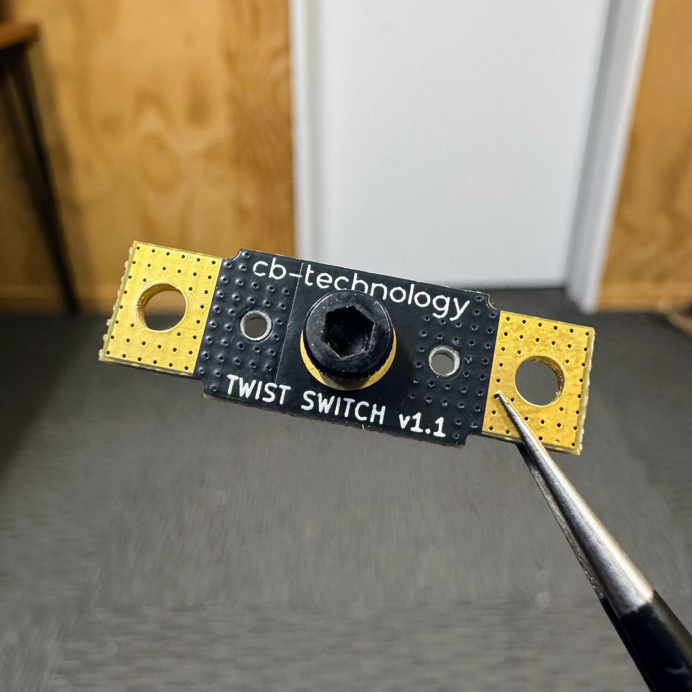
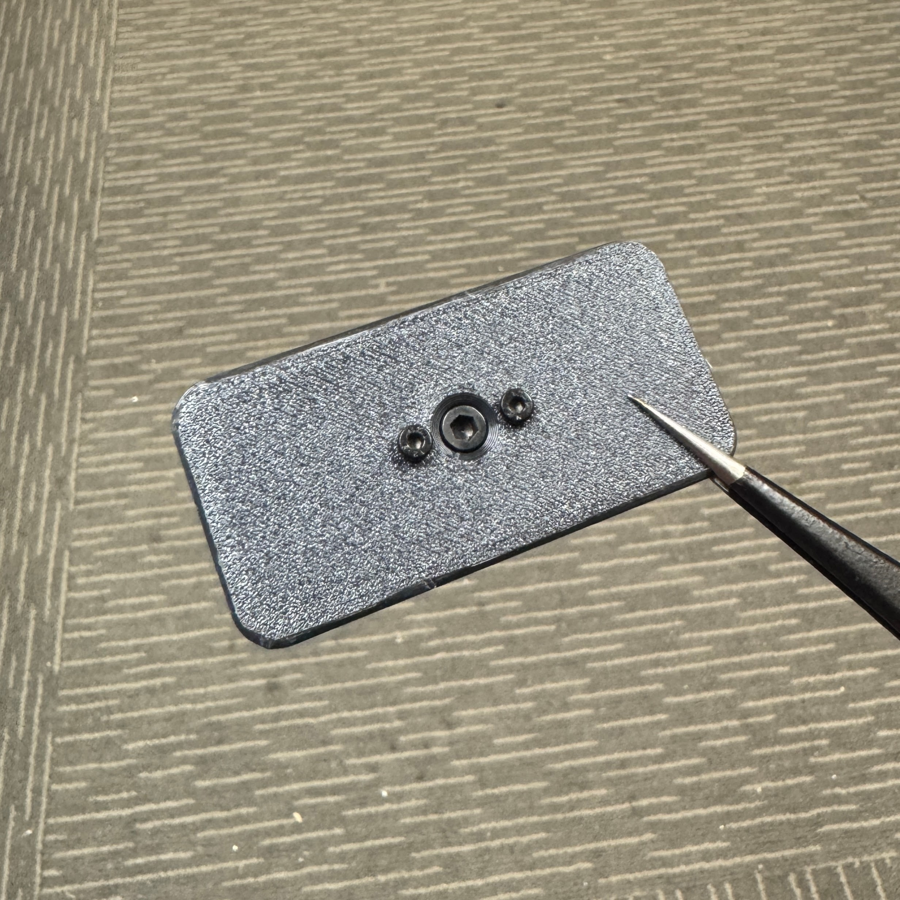
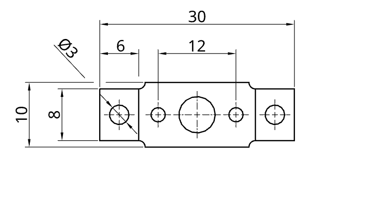
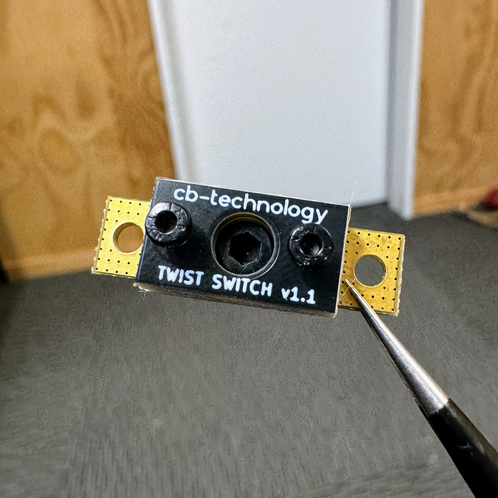
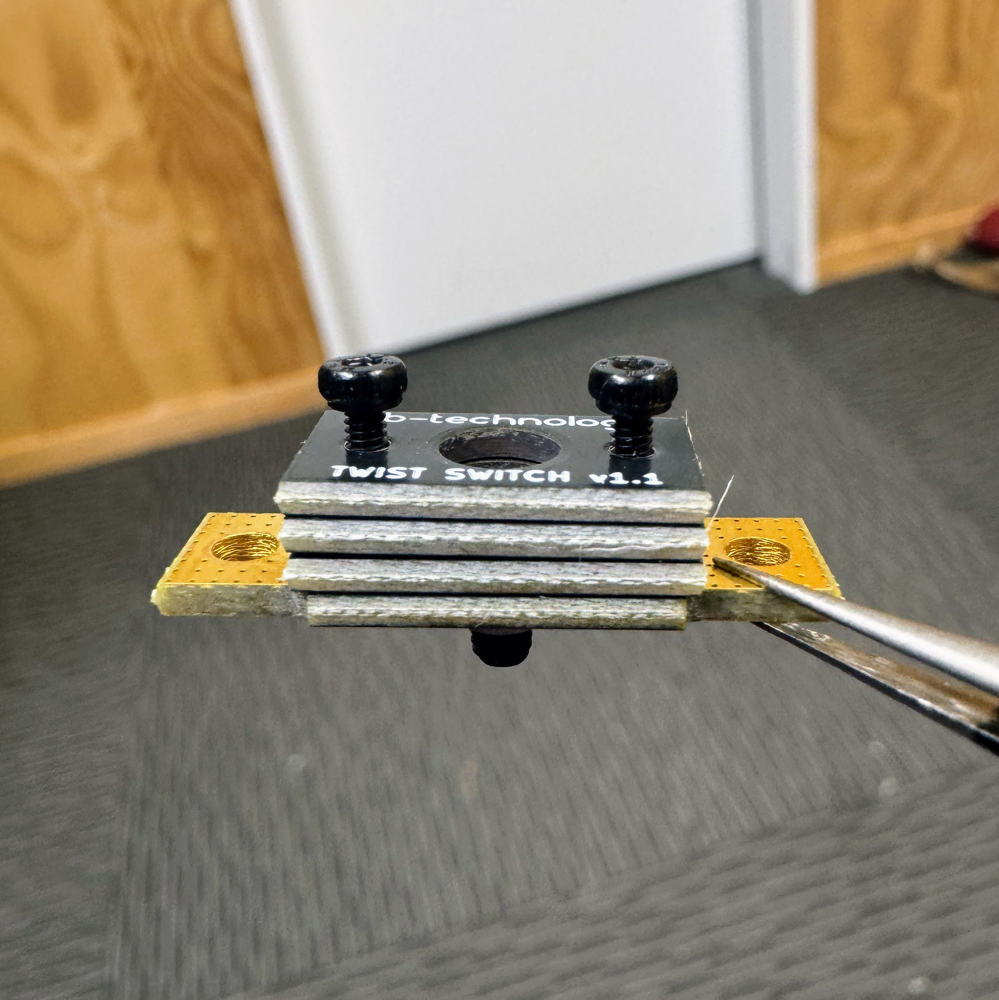

# TWIST SWITCH - v1.1

  

The TWIST SWITCH is a rugged manual power cutoff for combat robotics and other high-power applications.

Designed to safely and reliably connect or disconnect power with a simple twist. 

The switch uses a bolt to physically bridge power pads, forming a solid low-resistance connection that won’t shake loose under impact

Large solder pads are present on the top and bottom allowing multiple nets to be easily soldered to the switched output.

Designed and built in [Christchurch, New Zealand ](https://www.google.co.nz/maps/place/Christchurch+New+Zealand) by Connor Benton.

## SPECIFICATIONS

- **Dimensions:** 10x30x4mm
- **Weight:** 2g *excl wires*
- **Power Screw:** M3
- **Mounting Screw:** M2 
- **Spacer Height:** 1.6mm 

## PACKAGE INCLUDES

- 1x TWIST SWITCH
- 3x Spacer Plate
- 2x Mounting Screws

## Installation
 

### Product Layout
  

### Spacer Plate
The provided spacer plates allow the user ultimate flexibility to mount the TWIST SWITCH how they like, enabling it to be mounted, up to 4.8mm, off the surface.

  
  

## DISCLIAMER

This product, and all other cb-technology products, are intended for use in hobby projects, and for educational and experimental uses. These devices are not suitable for any application where human life or health or significant property value depend on their proper operation. cb-technology ltd are not responsible for any loss or damage incurred by the operation or failure of this product or any others. The specifications listed are accurate to the best of our knowledge but are not guaranteed in any way. The buyer assumes all responsibility for proper use, testing, and verification of this unit in any application. cb-technology ltd liability is limited to replacement of defective DOA units. By installing and using this unit you are agreeing to these terms. If you do not agree you may return any unused units for a refund.